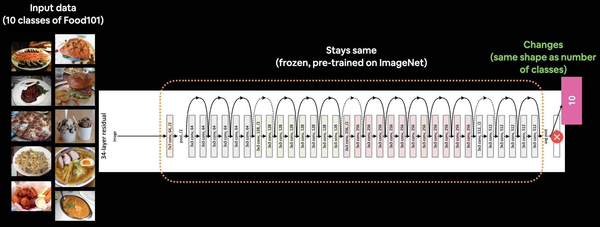

# food_101_vision_project

This project focuses on the Food-101 vision dataset, which consists of 101 food classes, each containing 1000 sample images. The goal is to classify these images into their respective categories and exceed the 77.2% accuracy achieved by a 2019 research paper. We aim to surpass this benchmark using the EfficientNetB0 model.

The research objectives are:

<ol>
  <li>Employ Transfer Learning Models: Implement the EfficientNetB0 and ResNet50 transfer learning models to process the Food-101 dataset.</li>
   <li>Optimize Model Performance: Fine-tune the EfficientNetB0 and ResNet50 models to achieve minimal loss and optimal accuracy.</li>
   <li>Evaluate on New Test Data: Use the model.predict function to assess the performance of the fine-tuned models on a new test dataset.</li>
   <li>Compare and Deploy Optimal Model: Analyze and compare the results of the CNN, EfficientNetB0, and ResNet50 models, and deploy the model that provides the most optimal solution.</li>
</ol>

